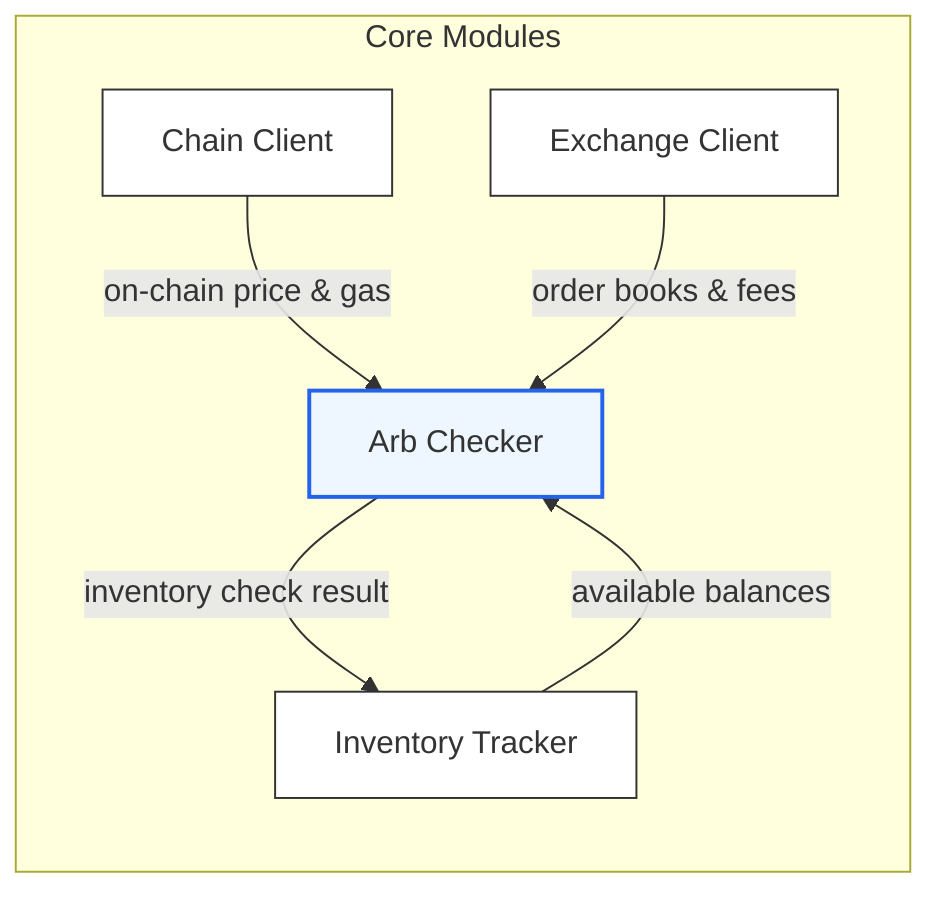
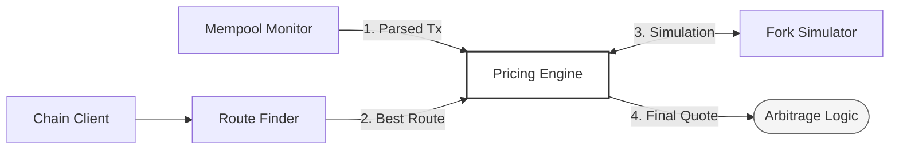

# Trading System

## Project Structure

```
core/      # core logic and basic types
chain/     # blockchain interaction classes
pricing/   # classes for blockchain price analysis
```

### core/

* **WalletManager** : class for secure and convenient wallet management
* **CanonicalSerializer** : Deterministic JSON serializer

### chain/

* **ChainClient** : RPC client with methods for blockchain operations
* **TransactionBuilder** : A class for constructing and preparing transactions
* **TransactionAnalyzer**: transaction analysis tool

### pricing/
* **ForkSimulator**: blockchain interaction simulator
* **MempoolMonitor**: monitoring pending transaction in real time
* **PriceImpactAnalyzer**: price pool analyzer
* **PricingEngine**: Orchestrator for routing, pool monitoring and fork simulation
* **RouterFinder**: class which handle token routing and output optimization considering gas costs
* **UniswapV2Pair**: AMM (Uniswap V2)

## Architecture






## Quick Start

### 1. Clone repository

```
git clone <repository_url>
```

### 2. Install dependencies

```bash
npm install
```

### 3. Environment setup

Create a `.env` file in the root folder and set the environment variables specified in `.env.example`

### 4. Start application

```bash
npm run start
```

---

## Usage

### Tests

* Run unit tests:
    ```bash
    npm run test:unit
    ```
    
* Run fork tests:
    1. Run local fork:
    ```bash
    ./scripts/start_fork.sh 
    ```
    2. Run fork tests:
    ```bash
    npm run test:integration
    ```


### Run integration test

```bash
ts-node scripts/integration-test.ts
```

#### Expected output

```
================ INTEGRATION TEST =================
Wallet Address:        0xC7Ff5013Db67Ed46E5fa87eEc79127496838FdE9
[ChainClient] [getBalance] succeeded in 651ms (attempt 1)
Balance:               0.049341098022665 ETH
[ChainClient] [getNonce] succeeded in 152ms (attempt 1)
Transaction Nonce:     25
[ChainClient] [estimateGas] succeeded in 161ms (attempt 1)
[ChainClient] [getGasPrice] succeeded in 291ms (attempt 1)
Estimated Gas Limit:   64551
Max Fee Per Gas:       4434426528
Max Priority Fee:      1439189
Recovered Signer:      0xC7Ff5013Db67Ed46E5fa87eEc79127496838FdE9
Signature Valid:       YES
---------------- Sending Transaction ----------------
[ChainClient] [sendTransaction] succeeded in 158ms (attempt 1)
Transaction Hash:      0xcd32b62569f627dbccdd1ccab24bb09a067d774dabcf7cfe94fba61cc55f364e
[ChainClient] Start waiting for receipt: 0xcd32b62569f627dbccdd1ccab24bb09a067d774dabcf7cfe94fba61cc55f364e, timeout=120s
[ChainClient] Receipt received for 0xcd32b62569f627dbccdd1ccab24bb09a067d774dabcf7cfe94fba61cc55f364e after 8136 ms
================ Transaction Receipt =================
Block Number:          10106313
Gas Used:              21000
Effective Gas Price:   1850224515
Transaction Fee:       0.000038854714815 ETH
Logs Count:            0
=======================================================
```

---

### Run transaction analyzer

```bash
ts-node .\src\chain\TransactionAnalyzer.ts <txHash>
```

#### Expected output

```
Transaction Analysis
====================
Hash:           0x3e5ecdfeba7c8532ea10c4ef6e99f83745117ed6dbe9e587eeaae52d45ef9973
Block:          10107427
Timestamp:      Fri, 23 Jan 2026 17:23:36 GMT
Status:         SUCCESS

From:           0xC7Ff5013Db67Ed46E5fa87eEc79127496838FdE9
To:             0xC7Ff5013Db67Ed46E5fa87eEc79127496838FdE9
Value:          0.0001 ETH

Gas Analysis
------------
Gas Limit:       64551
Gas Used:        21000 (32.53%)
Base Fee:        0.986218306 gwei
Priority Fee:    0.001439189 gwei
Effective Price: 0.987657495 gwei
Transaction Fee: 0.000020740807395 ETH

Function Called
---------------
Native ETH Transfer

Token Transfers
---------------
No ERC-20 transfers found

Swap Summary
------------
Sold:      0.0001 ETH (Native)
```

---

### Run price analyzer

```bash
ts-node scripts/price-analyzer-cli.ts 0xa0Ee7A142d267C1f36714E4a8F75612F20a79720 --token-in USDC --sizes 1000,10000,100000, 1000000
```

#### Expected output
```
Price Impact Analysis for USDC -> ETH
Pool: 0xa0Ee7A142d267C1f36714E4a8F75612F20a79720
Reserves: 2 000 000 USDC / 1 000 ETH
Spot Price: 0,001 ETH per USDC

┌───────────┬────────────┬────────────┬────────┐
│   USDC In │    ETH Out │ Exec Price │ Impact │
├───────────┼────────────┼────────────┼────────┤
│     1 000 │   0,498252 │   2 007,02 │  0.35% │
├───────────┼────────────┼────────────┼────────┤
│    10 000 │   4,960273 │   2 016,02 │  0.79% │
├───────────┼────────────┼────────────┼────────┤
│   100 000 │  47,482974 │   2 106,02 │  5.03% │
├───────────┼────────────┼────────────┼────────┤
│ 1 000 000 │ 332,665999 │   3 006,02 │ 33.47% │
└───────────┴────────────┴────────────┴────────┘

Max trade for 1% impact: 14 183,966 USDC

```

### Run Arb Checker

```bash
npx ts-node scripts/arb-checker-cli.ts ETH/USDT --size 1
```

#### Expected output
```
 ARB CHECK: ETH/USDT (size: 1 ETH)

Prices:
  Uniswap V2:      2,045.66 (buy 1 ETH)
  Binance bid:      2,050.46

Gap: 4.80 (23.5 bps)

Costs:
  DEX fee:           30.0 bps
  DEX price impact:   2.8 bps
  CEX fee:           10.0 bps
  CEX slippage:       0.0 bps
  Gas:               0.31 (1.5 bps)

  Total costs:       44.3 bps

Net PnL estimate: -20.9 bps  NOT PROFITABLE

Inventory:
  Wallet USDT:  200,000 (need 2,046)
  Binance ETH:   100 (need 1)

Verdict: SKIP  costs exceed gap
```

### Run Order Book CLI

```bash
ts-node scripts/orderbook-cli.ts ETH/USDT --depth 20
```

#### Expected output
```
 ETH/USDT Order Book Analysis
  Timestamp: 2026-02-06 21:13:58.504Z

  Best Bid:     $2,047.84  26.0658 ETH
  Best Ask:     $2,047.85  58.167 ETH
  Mid Price:    $2,047.85
  Spread:       $0.01 (0.05 bps)

  Depth (within 10 bps):
    Bids: 26.96 ETH ($55,203.62)
    Asks: 68.02 ETH ($139,287.79)
  Imbalance: -0.43 (sell pressure)

  Walk-the-book (2 ETH buy):
    Avg price:  $2,047.85
    Slippage:   0.00 bps
    Levels:     1
  Walk-the-book (10 ETH buy):
    Avg price:  $2,047.85
    Slippage:   0.00 bps
    Levels:     1

  Effective spread (2 ETH round-trip): 0.049 bps
```


### Run Rebalance CLI

```bash
ts-node scripts/rebalance-cli.ts --check
ts-node scripts/rebalance-cli.ts --plan ETH
```
#### Expected output

```
Inventory Skew Report

Asset: ETH
  Binance:  2 ETH  (20%)    deviation: -30%
  Wallet:  8 ETH  (80%)    deviation: +30%
  Status:   NEEDS REBALANCE

Asset: USDT
  Binance:  18,000 USDT  (60%)    deviation: +10%
  Wallet:  12,000 USDT  (40%)    deviation: -10%
  Status:   OK (deviation: 10%)
```

```
Rebalance Plan: ETH

Transfer 1:
  From:     wallet
  To:       binance
  Amount:   3 ETH
  Fee:      0.005 ETH (~$10.00)
  ETA:      ~15 min

  Result:
    Binance:  4.995 ETH (50%)
    Wallet:  5 ETH (50%)

Estimated total cost: ~$10.00 (fees), time ~15 min
```

### Run PnL CLI

```bash
ts-node scripts/pnl-cli.ts --summary
```

#### Expected output
```
PnL Summary (last 24h)

Total Trades:        5
Win Rate:            60.0%
Total PnL:           $1.70
Total Fees:          $19.80
Avg PnL/Trade:       $0.34
Avg PnL (bps):       2.7 bps
Best Trade:          $6.00
Worst Trade:         -$5.90
Total Notional:      $9,807.50

Recent Trades:
  20:51  ETH  Buy Binance / Sell Wallet  -$4.60 (-25.5 bps)
  20:56  ETH  Buy Wallet / Sell Binance  +$4.00 (20.0 bps)
  21:01  ETH  Buy Binance / Sell Wallet  -$5.90 (-24.5 bps)
  21:06  ETH  Buy Wallet / Sell Binance  +$2.20 (13.7 bps)
  21:11  ETH  Buy Wallet / Sell Binance  +$6.00 (30.0 bps)
```

## Features

* Retry logic with exponential backoff was implemented in **ChainClient** to ensure reliable behaviour during RPC instability
* **TransactionBuilder** : convenient builder for transactions
* **WalletManager** : a wallet wrapper for secure and convenient wallet management
* Multi hop routing optimizations for better output considering gas costs
* Trade simulation to choose optimal trading strategy.
* **Arb Checker**: end-to-end opportunity detector combining on-chain DEX pricing, CEX order books, fee/impact/slippage/gas costing, and inventory gating.
* **Order Book Analyzer**: depth, imbalance, walk-the-book, and effective spread metrics for any CEX order book.
* **PnL Engine**: records arbitrage legs and exports CSV summaries (net PnL, bps, win rate, Sharpe estimate).
